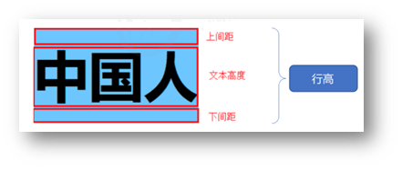

# CSS 简介

层叠样式表 (Cascading Style Sheets，缩写为 CSS），是一种 **样式表** 语言，用来**描述 HTML 文档的呈现**（**美化内容**）。

CSS特性：化简代码 / 定位问题，并解决问题

* 继承性
    * 继承性：子级默认继承父级的**文字控制属性**。 
    * 注意：如果标签有默认文字样式会继承失败。 例如：a 标签的颜色、标题的字体大小。
* 层叠性
    * 相同的属性会覆盖：**后面的 CSS 属性覆盖前面的 CSS 属性**
    * 不同的属性会叠加：**不同的 CSS 属性都生效**
* 优先级
    * 规则：选择器**优先级高的样式生效**。
    * 公式：**通配符选择器 < 标签选择器 < 类选择器 < id选择器 < 行内样式 < !important**（选中标签的范围越大，优先级越低）
    * 复合选择器-叠加
        * `（行内样式，id选择器个数，类选择器个数，标签选择器个数）`
        * 从左向右依次比较选个数，同一级个数多的优先级高，如果个数相同，则向后比较
        * **!important 权重最高**
        * 继承权重最低

# CSS 书写位置

* **内部**样式表：学习使用
    * CSS 代码写在头部 `style` 标签里面

```html
  <head>
    <title>网页标题</title>
    <style>CSS样式</style>
  </head>
```

* **外部**样式表：开发使用
    * CSS 代码写在单独的 CSS 文件中（**.css**）
    * 在 HTML 使用 `link `标签引入

```html
<link rel="stylesheet" href="./my.css">
```

* **行内**样式：配合 JavaScript 使用
    * CSS 写在标签的 `style` 属性值里

```html
<div style="color: red; font-size:20px;">这是 div 标签</div>
```

# CSS 书写顺序

1. 盒子模型属性
2. 文字样式
3. 圆角、阴影等修饰属性

# CSS 基础语法

整体语法：`选择器{ 属性: 值; 属性: 值}`

## 选择器

### 标签选择器

标签选择器：使用**标签名**作为选择器 → 选中**同名标签设置相同的样式**。

例如：p, h1, div, a, img......

```html
<style>
  p {
    color: red;
  }
</style>
```

### 类选择器

作用：查找标签，**差异化**设置标签的显示效果。

* 定义类选择器 → **.类名**
* 使用类选择器 → 标签添加 **class="类名"**
* 一个类选择器**可以供多个标签使用**
* **一个标签可以使用多个类名**，类名之间用**空格**隔开

```html
<style>
  /* 定义类选择器 */
  .red {
    color: red;
  }
</style>

<!-- 使用类选择器 -->
<div class="red">这是 div 标签</div>
<div class="red size">div 标签</div>
```

> 开发习惯：类名见名知意，多个单词可以用 - 连接，例如：news-hd。

### id 选择器

作用：查找标签，差异化设置标签的显示效果。

- id 选择器一般**配合 JavaScript** 使用，很少用来设置 CSS 样式
- 规则：同一个 id 选择器在一个页面只能使用一次。

* 定义 id 选择器 → #id名
* 使用 id 选择器 → 标签添加 id= "id名”

```html
<style>
  /* 定义 id 选择器 */
  #red {
    color: red;
  }
</style>

<!-- 使用 id 选择器 -->
<div id="red">这是 div 标签</div>
```

### 通配符选择器

作用：查找页面**所有**标签，设置相同样式。

 `*`**不需要调用**，浏览器自动查找页面所有标签，设置相同的样式

```css
* {
  color: red;
}
```

> 经验：通配符选择器可以用于**清除标签的默认样式**，例如：标签默认的外边距、内边距。

```css
/* 清除默认内外边距 */
* {
  margin: 0;
  padding: 0;
  box-sizing: border-box;
}
/* 清除列表项目符号 */
li {
  list-style: none;
}
```

### 复合选择器

#### 后代选择器:

>- 父选择器  子选择器 { CSS 属性}
>
>- 选中某元素的后代元素
>
>- 父子选择器之间用**空格**隔开

```html
<style>
  div span {
    color: red;
  }
</style>
<span> span 标签</span>
<div>
  <span>这是 div 的儿子 span</span >
</div>
```

#### 子代选择器

> - 父选择器 > 子选择器 { CSS 属性}
>
> - 选中某元素的子代元素（**最近的子级**）
> - 父子选择器之间用 **>** 隔开

```html
<style>
  div > span {
    color: red;
  }
</style>

<div>
  <span>这是 div 里面的 span</span>
  <p>
    <span>这是 div 里面的 p 里面的 span</span>
  </p>
</div>
```

#### 并集选择器

> - 选择器1, 选择器2, …, 选择器N { CSS 属性}
>
> - 选中**多组标签**设置**相同**的样式
> - 选择器之间用 **,** 隔开

```html
<style>
  div,
  p,
  span {
    color: red;
  }
</style>

<div> div 标签</div>
<p>p 标签</p>
<span>span 标签</span>
```

#### 交集选择器

>选择器1选择器2 { CSS 属性}
>
>- 选中**同时满足多个条件**的元素
>- 选择器之间连写，没有任何符号
>- 注意：如果交集选择器中有标签选择器，标签选择器必须书写在最前面。 

```html
<style>
  p.box {
  color: red;
}
</style>

<p class="box">p 标签，使用了类选择器 box</p>
<p>p 标签</p>
<div class="box">div 标签，使用了类选择器 box</div>
```

#### 伪类选择器

##### 超链接伪类：

> - 鼠标悬停状态：**选择器:hover { CSS 属性 }**
> - 伪类表示元素**状态**，选中元素的某个状态设置样式。
> - `:link`：访问前
> - `:visited`：访问后
> - `:hover`：鼠标悬停
> - `:active`：点击时（激活的那一瞬间）

```html
<style>
  a:hover {
    color: red;
  }
  .box:hover {
    color: green;
  }
</style>

<a href="#">a 标签</a>
<div class="box">div 标签</div>
```

提示：如果要给超链接设置以上四个状态，需要按 LVHA 的顺序书写。 

经验：工作中，一个 a 标签选择器设置超链接的样式， hover状态特殊设置 

```css
a {
  color: red;
}

a:hover {
  color: green;
}
```

#### 结构伪类选择器

> - 根据元素的**结构关系**查找元素。 
> - `E:first-child`：查找第一个 E 元素
> - `E:last-child`：查找最后一个 E 元素
> - `E:nth-child(N)`：查找第 N 个 E 元素（第一个为 1）
>     - 2n 偶数
>     - 2n-1/2n+1 奇数
>     - 5n 找到 5 的倍数
>     -  n+5 找到第 5 个以后的标签
>     -  -n+5 找到第 5 个以前的标签
>     -  提示：公式中的n取值从 **0** 开始。 

```css
li:first-child {
  background-color: green;
}
```

#### 伪元素选择器

> - 作用：创建**虚拟元素**（伪元素），用来**摆放装饰性的内容**。 
> - `E::before`：在 E 元素里面最前面添加一个伪元素
> - `E::after`：在 E 元素里面最后面添加一个伪元素
> - 必须设置 **content: ””属性**，用来 设置伪元素的内容，如果没有内容，则**引号留空**即可
> - 伪元素默认是**行内**显示模式
> - **权重和标签选择器相同**

```css
div::before {
  content: "before 伪元素";
}
div::after {
  content: "after 伪元素";
}
```

## 样式属性

### 文字属性

- `font-family`：字体族
    - `font-family: Microsoft YaHei, Heiti SC, sans-serif;`
    - 各个字体名用逗号隔开，执行顺序是从左向右依次查找
- `font-size`：字体大小
    - `30px`
- `font-wight`：字体粗细
    - `0-700`
    - 
- `font-style`：是否倾斜
    - `normal`
    - `italic`
- `text-indent`：文本缩进
    - `20px`
    - `1.2em`（推荐：**1em = 当前标签的字号大小**）
- `text-align`：水平对齐方式
    - `left`：默认，左对齐
    - `center`：居中对齐
    - `right`：右对齐
    - `text-align`本质是控制内容的对齐方式，属性要设置给内容的父级。 
- `text-decoration`：文本修饰线
    - `none`：无
    - `underline`：下划线
    - `line-through`：删除线
    - `overline`：上划线
- `color`：文本颜色
    - `red` 、`green`、`blue`
    - `rgb(r,g,b,a)`，RGB各自取值 0-255，a 指透明度，取值 0-100，a 可不写
    - `#RRGGBB`
- `line-height`：行高
    - `30px`
    - `2`（字体大小的倍数）
    - 行高的测量方法：从一行文字的最顶端（最底端）量到下一行文字的最顶端（最底端）。 

```css
line-height: 30px;
/* 当前标签字体大小为16px */
line-height: 2;
```



垂直居中技巧：**行高属性值等于盒子高度属性值**

注意：该技巧适用于单行文字垂直居中效果

```css
div {
  height: 100px;
  background-color: skyblue;
  /* 注意：只能是单行文字垂直居中 */
  line-height: 100px;
}
```

#### 复合属性

> 复合属性：属性的简写方式，**一个属性对应多个值的写法**，各个属性值之间用**空格**隔开。
>
> 注意：字号和字体值必须书写，否则 font 属性不生效 。
>
> **font: 是否倾斜  是否加粗  字号/行高 字体（必须按顺序书写）**

```css
div {
  font: italic 700 30px/2 楷体;
}
```

### 背景属性

- `background-color`：背景色
- `background-image`：背景图
    - `url(./images/1.png)`
- `background-repeat`：平铺方式
    - `no-repeat`：不平铺
    - `repeat`：平铺（默认）
    - `repeat-x`：水平方向平铺
    - `repeat-y`：垂直方向平铺
- `background-position`：背景图位置
    - `left`：左侧
    - `right`：右侧
    - `center`：居中
    - `top`：顶部
    - `bottom`：底部
    - `50px -100px`
        - 水平：正数向右；负数向左
        - 垂直：正数向下；负数向上
        - 可以只写一个关键字，另一个方向默认为居中；数字只写一个值表示水平方向，垂直方向为居中
- `background-size`：背景图大小
    - `cover`：等比例缩放背景图片以完全覆盖背景区，可能背景图片部分看不见
    - `contain`：等比例缩放背景图片以完全装入背景区，可能背景区部分空白
    - 百分比：根据盒子尺寸计算图片大小
    - 数字 + 单位（例如：px）
- `background-attachment`：背景不会随着元素的内容滚动。
    - `fixed`

#### 复合属性

> 属性名：**background**（bg）
>
> 属性值：背景色 背景图 背景图平铺方式 背景图位置/背景图缩放  背景图固定（**空格隔开各个属性值，不区分顺序**）
>
> ```css
> div {
>   width: 400px;
>   height: 400px;
> 
>   background: pink url(./images/1.png) no-repeat right center/cover;
> }
> ```


