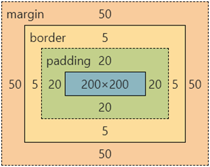
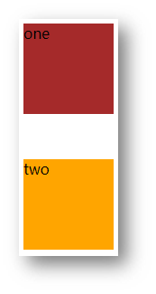
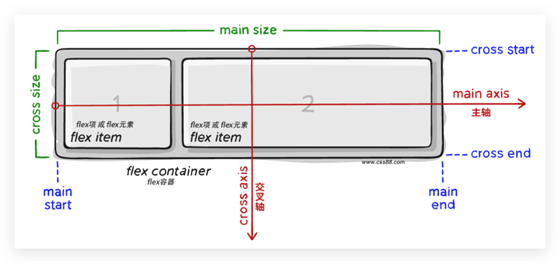

# CSS 布局

- 显示模式
- 盒子模型
- flex 布局
- 定位

# 显示模式

- 显示模式：标签（元素）的显示方式。 

- 作用：布局网页的时候，根据标签的显示模式选择合适的标签摆放内容。 

- 块元素
    - 独占一行
    - 宽度默认是父级的100%
    - 添加宽高属性生效
- 行内元素
    - 一行可以显示多个
    - 设置宽高属性不生效
    - 宽高尺寸由内容撑开
- 行内块元素
    - 一行可以显示多个
    - 设置宽高属性生效
    - 宽高尺寸也可以由内容撑开

- `display`：转换显示模式
    - `block`：块
    - `inline-block`：行内块
    - `inline`：行内

# 盒子模型

## 基础属性

- 内容区域

    - `width`：宽

    - `height`：高

- `padding`：内边距（出现在内容与盒子边缘之间）

    - `padding: 30px;`-四个方向 内边距相同
    - `padding-top: 10px;`
    - `padding-right: 20px;`
    - `padding-bottom: 40px;`
    - `padding-left: 80px;`
    - `padding` 多值写法
        - 从**上**开始**顺时针**赋值，当前方向没有数值则与**对面取值相同**。 
        - `padding:10px;`-四个方向都是 10px
        - `padding:10px 20px 30px 40px;`-上 10，右 20，下 30，左40
        - `padding:10px 20px 30px;` -上 10，左右 20，下 30
        - `padding:10px 20px;`-上 10，左右 20

- `border`：边框线
    - `solid`：实线
    - `dashed`：虚线
    - `dotted`：点线
    - 单方向边框线
        - `border-方位名词:：边框线粗细  线条样式  颜色（不区分顺序）`
        - `border-top: 2px solid red;`
- `margin`：外边距（出现在盒子外面）
    - `padding`与内边距一致

- `background-color`：背景色

- 尺寸计算
    - 默认情况：盒子尺寸 = 内容尺寸 + border 尺寸 + 内边距尺寸
    - 结论：给盒子加 border / padding 会撑大盒子
    - 手动做减法，减掉 border / padding 的尺寸
    - 內减模式
        - `box-sizing:border-box`



## 特殊属性

### 版心居中

左右 margin 值 为 auto（盒子要有宽度）

```css
div {
  margin: 0 auto;
  width: 1000px;
  height: 200px;
  background-color: pink;
}
```

- `overflow`：元素溢出，控制溢出元素的内容的显示方：
    - `hidden`：溢出隐藏
    - `scroll`：溢出滚动（无论是否溢出，都显示滚动条位置）
    - `auto`：溢出滚动（溢出才显示滚动条位置）

### 外边距问题

- 合并现象
    - 场景：**垂直**排列的兄弟元素，上下 **margin** 会**合并**
    - 现象：取两个 margin 中的**较大值生效**

```css
.one {
  margin-bottom: 50px;
}
.two {
  margin-top: 20px;
}
```



### 外边距塌陷

- 场景：父子级的标签，子级的添加 **上外边距** 会产生**塌陷**问题
- 现象：**导致父级一起向下移动**
- 解决方法：

    * 取消子级margin，父级设置padding
    * 父级设置 overflow: hidden
    * 父级设置 border-top

```css
.son {
  margin-top: 50px;
  width: 100px;
  height: 100px;
  background-color: orange;
}
```


### 行内元素 – 内外边距问题

场景：行内元素添加 margin 和 padding，无法改变元素垂直位置

解决方法：给行内元素添加 **line-height** 可以改变垂直位置

```css
span {
  /* margin 和 padding 属性，无法改变垂直位置 */
  margin: 50px;
  padding: 20px;
  /* 行高可以改变垂直位置 */
  line-height: 100px;
}
```

### 圆角

属性名：**border-radius**

属性值：数字+px / 百分比

提示：属性值是圆角半径

正圆形状：给正方形盒子设置圆角属性值为 **宽高的一半 / 50%**

`border-radius: 50%;`

胶囊形状：给长方形盒子设置圆角属性值为 盒子高度的一半 

```css
div {
  width: 200px;
  height: 80px;
  background-color: orange;
  border-radius: 40px;
}
```

### 盒子阴影

作用：给元素设置阴影效果

属性名：**box-shadow**

属性值：X 轴偏移量  Y 轴偏移量  模糊半径  扩散半径  颜色  内外阴影

注意： 

* X 轴偏移量 和 Y 轴偏移量 必须书写
* 默认是外阴影，内阴影需要添加 inset

```css
div {
  width: 200px;
  height: 80px;
  background-color: orange;
  box-shadow: 2px 5px 10px 0 rgba(0, 0, 0, 0.5) inset;
}
```

# flex 布局

## 标准流

标准流也叫文档流，指的是标签在页面中**默认的排布规则**，例如：块元素独占一行，行内元素可以一行显示多个。 

## flex布局简介

Flex 布局也叫**弹性布局**，是浏览器**提倡的布局模型**，非常适合**结构化**布局，提供了强大的空间分布和对齐能力。

Flex 模型不会产生浮动布局中脱标现象，布局网页更简单、更灵活。

### Flex组成

设置方式：给**父**元素设置 **display: flex**，子元素可以自动挤压或拉伸

组成部分：

* 弹性容器（父）
    * `display: flex;`——设置 flex 布局
    * `flex-direction`——修改主轴方向
        * 主轴**默认**在**水平方向**，侧轴默认在垂直方向
        * `row`——水平方向，从左向右（默认）
        * `column`——垂直方向，从上向下
        * `row-reverse`——水平方向，从右向左
        * `column-reverse`——垂直方向，从下向上

    * `justify-content`——主轴对齐方式
        * `flex-start`——默认值，弹性盒子从起点开始依次排列
        * `flex-end`——弹性盒子从终点开始依次排列
        * `center`——弹性盒子沿主轴居中排列
        * `space-between`——弹性盒子沿主轴均匀排列，空白间距均分在弹性盒子之间
        * `space-around`——弹性盒子沿主轴均匀排列，空白间距均分在弹性盒子两侧
        * `space-evenly`——弹性盒子沿主轴均匀排列，弹性盒子与容器之间间距相等

    * `align-items`——侧轴对齐方式
        * 当前弹性容器内**所有**弹性盒子的侧轴对齐方式
        * `strech`——弹性盒子沿着侧轴线被拉伸至铺满容器（弹性盒子没有设置侧轴方向尺寸则默认拉伸）
        * `center`——弹性盒子沿侧轴居中排列
        * `flex-start`——弹性盒子从起点开始依次排列
        * `flex-end`——弹性盒子从终点开始依次排列

    * `flex-wrap`——弹性盒子换行
        * 弹性盒子可以自动挤压或拉伸，默认情况下，所有弹性盒子都在一行显示。
        * `wrap`——换行
        * `nowrap`——不换行（默认）

    * `align-content`——行内对齐方式（多行下，每一行的排列方式，也可理解列排列）
        * `flex-start`——默认值，弹性盒子从起点开始依次排列
        * `flex-end`——弹性盒子从终点开始依次排列
        * `center`——弹性盒子沿主轴居中排列
        * `space-between`——弹性盒子沿主轴均匀排列，空白间距均分在弹性盒子之间
        * `space-around`——弹性盒子沿主轴均匀排列，空白间距均分在弹性盒子两侧
        * `space-evenly`——弹性盒子沿主轴均匀排列，弹性盒子与容器之间间距相等

* 弹性盒子（子）
    * `flex`——弹性伸缩比
        * 控制弹性盒子的主轴方向的尺寸
        * 属性值：整数数字，表示占用**父级剩余尺寸的份数**。

    * `align-self`——侧轴对齐方式
        * 单独控制**某个弹性盒子**的侧轴对齐方式
        * `strech`——弹性盒子沿着侧轴线被拉伸至铺满容器（弹性盒子没有设置侧轴方向尺寸则默认拉伸）
        * `center`——弹性盒子沿侧轴居中排列
        * `flex-start`——弹性盒子从起点开始依次排列
        * `flex-end`——弹性盒子从终点开始依次排列

* 主轴：默认在**水平**方向
* 侧轴 / 交叉轴：默认在**垂直**方向



# 定位

作用：灵活的改变盒子在网页中的位置

实现：

1.定位模式：position

2.边偏移：设置盒子的位置

* left
* right
* top
* bottom


