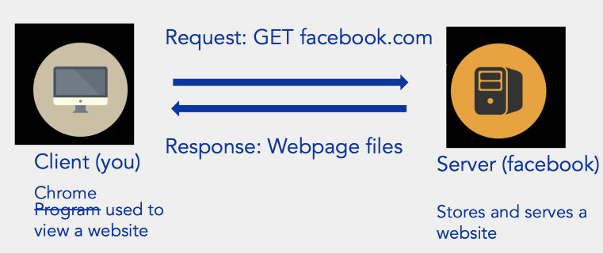
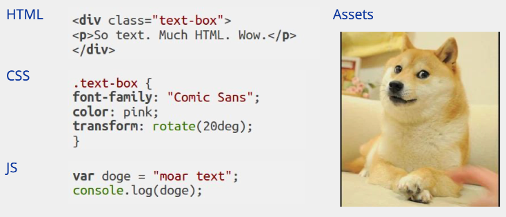
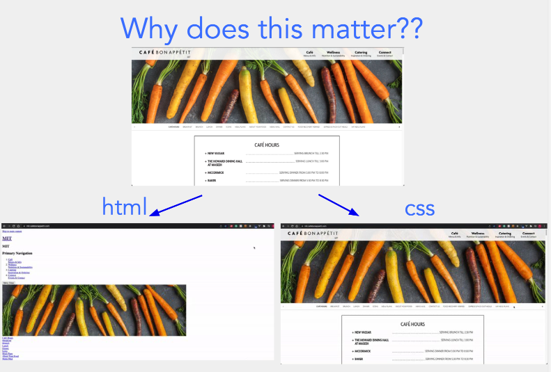
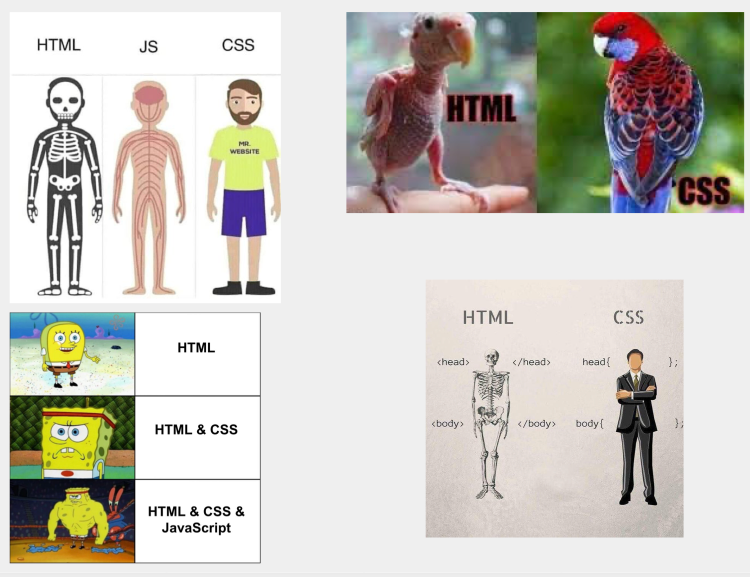
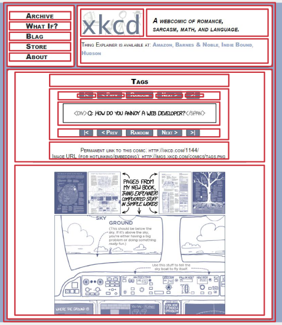

# web-basic

## Accessing a Website

## Webpage files

## You must build...

- Dynamic website supported by a back-end
- Personalized experience based on user accounts
- Minimum security requirements fulfilled
- Original design and implementation
- Use Git on a web.lab Github repo

# Intro to HTML/CSS

HTML ( Hypertext Markup Language ) : The language your web browser uses to describe the content and structure of web pages.

## HTML = Nested Boxes

