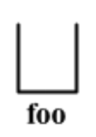
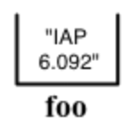

# lecture1-Types, variables, operators

- introduction java
- helloworld
- Types
- Operators


# introduction java

## Programming Languages Purpose

- Easier to understand than CPU instructions
- Needs to be translated for the computer
- Programs describe a process (“how to do x”) very precisely

## Java

- “Most popular” language
- More complex than some (eg. Python)
- Simpler than others (eg. C++)

## What can Java do?

- Server apps (Gmail)
- Mobile apps (Android)
- Business apps (SAP)

# helloworld

```java
class Hello {
    public static void main(String[] arguments) {
        // Program execution begins here
        System.out.println("Hello world.");
    }
}
```

explain：

1. Program Structure

```java
class CLASSNAME {
    public static void main(String[] arguments) {
        STATEMENTS
    }
}
```

2. Output to the console

`System.out.println(“your text here”)`

3. Comments

`// this text is ignored`

Comments are notes for humansBoth yourself, and others

# Types

## Variables

A “box” that stores a value of one type.

Form: `TYPE NAME;`

Example: `String foo;`



**Assignment**

Use = to give variables a value.

Can be combined with a variable declaration.

Example: 

```java
class Hello1 {
    public static void main(String[] arguments) {
        String foo;
		foo = “IAP 6.092”;
        double badPi = 3.14;
		boolean isJanuary = true;
        System.out.println(foo);
        foo = "Something else";
        System.out.println(foo);
    }
}
```



## Types

Kinds of values that can be stored and manipulated.

- boolean: Truth value (true or false).
- int: Integer (0, 1, -47).
- double: Real number (3.14, 1.0, -2.1).
- String: Text (“hello”, “example”).

## Assigning Different Types

```java
double score = 7.0 / 2.0;  // = 3.5
int score = 7 / 2;	// When dividing integers, the fractional part is discarded
```

## Converting Between Types

If a conversion will not “lose” data, it is automatically permitted.

If a conversion might lose data, it must be forced (casting).

```java
double score = 3.5;
int otherScore = (int) score;  
double yetAnotherScore = otherScore;
```

# Operators

Symbols that perform simple computations

- Assignment: `=`
- Addition: `+`
- Subtraction: `-`
- Multiplication: `*`
- Division: `/`

## Order of Operations

Follows standard math rules:

- Parentheses

- Multiplication and division

- Addition and subtraction

# String Concatenation (+)

```java
String text = "hello" + " world";
text = text + " number " + 5;  // converted 					automatically 
// text = "hello world number 5"
```

# Assignment: GravityCalculator

Compute the position of a falling object:    $x(t) = 0.5 × at^2 + v_it + x_i$

In this assignment, you will create a program that computes the distance an object will fall in Earth's gravity.

## Part One

1. Create a new class called `GravityCalculator`.

2. Copy and paste the following initial version:

    ```java
    class GravityCalculator {
        public static void main(String[] arguments) {
            double gravity = -9.81;  // Earth's gravity in m/s^2
            double initialVelocity = 0.0;
            double fallingTime = 10.0;
            double initialPosition = 0.0;
            double finalPosition = 0.0;
            System.out.println("The object's position after " + fallingTime + " seconds is " + finalPosition + " m.");
        }
    }
    ```

3. Run it in Eclipse (Run → Run As → Java Application).

What is the output of the unmodified program? Include this as a comment in the source code of your submission.

## Part Two

Modify the example program to compute the position of an object after falling for 10 seconds, outputting the position in meters. The formula in Math notation is:

x(t) = 0.5 × at2 + vit + xi

| Variable | Meaning                | Value |
| -------- | ---------------------- | ----- |
| a        | Acceleration (m/s2)    | -9.81 |
| t        | Time (s)               | 10    |
| vi       | Initial velocity (m/s) | 0     |
| xi       | Initial position       | 0     |

*Note*: The correct value is -490.5 m. Java will output more digits after the decimal place, but that is unimportant.


