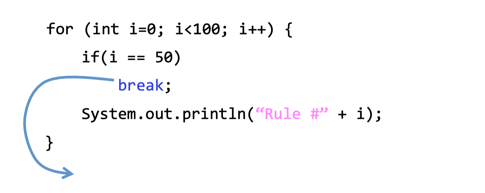
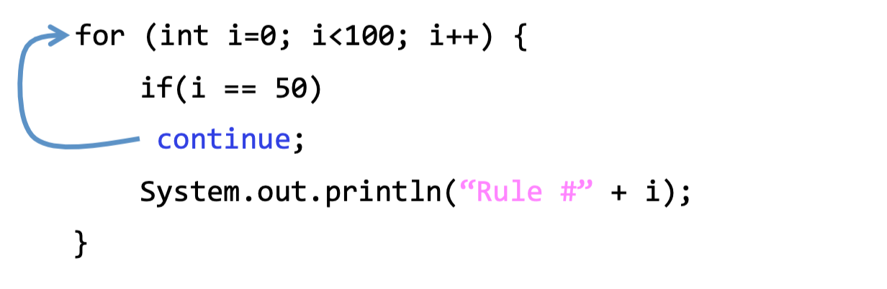
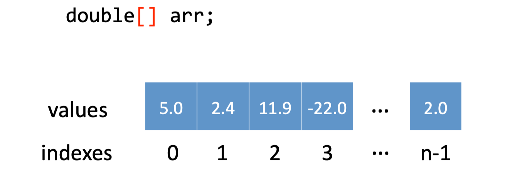
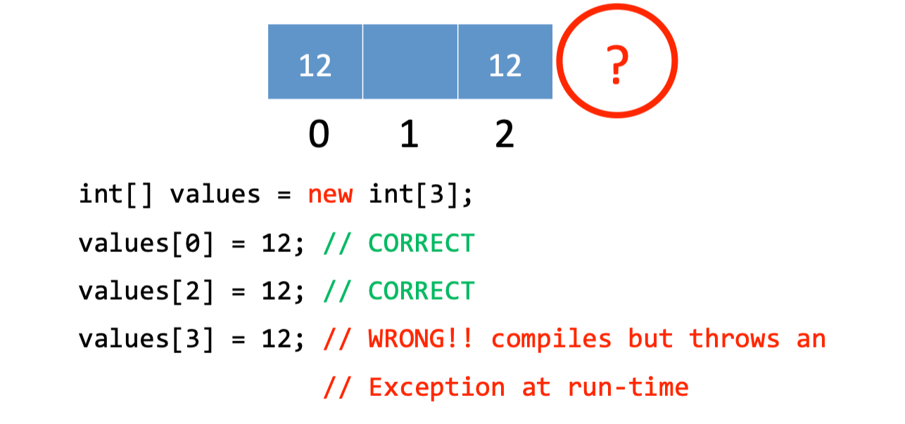
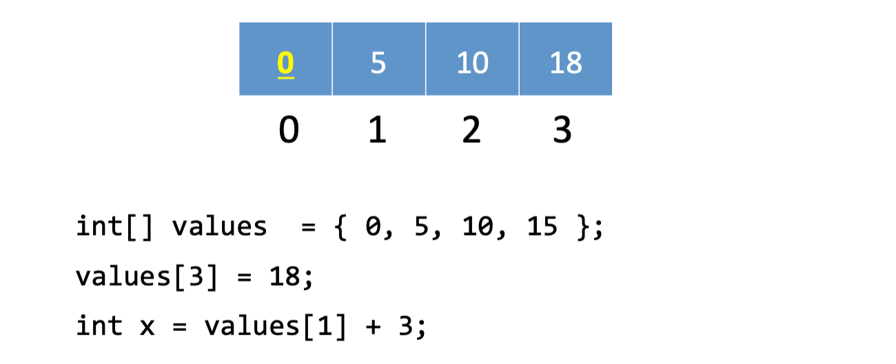

# lecture3-Loops and arrays

- Good
 programming 
style

- Loops

- Arrays


# Good
 programming 
style

Goal:
 readable
code


- Rule
 1:
 Use 
Meaningful
 Names

- Rule
 2: 
Use 
indentation

- Rule 3: Use Whitespaces
- Rule 4: Don’t Duplicate Tests

# Loops

Loop through a block of code.

Several loop operators in Java. 

- while
- for

## The while operator

```java
int i = 0;
while (i < 3) { 
    System.out.println(“Rule #“ + i); 
    i = i+1;
}
```

• Count carefully (off-by-one error) 

• Make sure your loop will finish

- while (true);

## The for operator

```java
for (initialization; condition; update){ 
    statements
}
```

## break

break terminates a for or while loop



## continue

continue skips the current iteration of a loop and proceeds directly to the next iteration



## A 
Loop 
Within 
a 
Loop

Variable
 defined 
in 
initialization 
can 
be 
used 
within 
its
 for 
block


```java
for(int i = 0; i<3; i++){
    for(int j=2; j<4; j++){
        System.out.println(i + "" + j);
    }
}
```

# Arrays


- An array is an indexed list of values
- You can make an array of any type
- All elements of array must have the same type

### Defining
 Arrays
: 

```java
int[] arrayName;	// array of int
int[][] arrayName1;	// int[] is a type; (int[])[] arrayName1;
```

### Creating 
Arrays
:

- To create an array of a given size, use operator `new`
- Or you may use variable to specify the size

```java
int[] values = new int[5];

int size = 12;
int [] values1 = new int[size];
```

### Initializing Arrays:

Curly braces can be used to initialize an array.

It can only be used when you declare the variable.

```java
int[] values = {12, 23, -24, 47}
```

### Arrays 
Example
:



### Accessing 
Arrays

- The index starts at zero and ends at length-1.



- To access elements of array, use the `[ ]` operator



### The
 length
 variable


Each array has a `length` variable built-in that contains the length of the array.

```java
int[] values = new int[12];
int size = values.length;	// 12
```

### Combining 
Loops 
and 
Arrays

Print square of elements in values

```java
int[] values = {1, 2, 3, 4, 6};
int square = 0;

for(int i=0; i < values.length; i++){
    square = values[i] * values[i];
    System.out.println(square);
}
```

## Assignment 3


