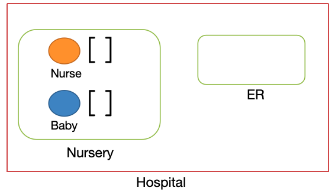
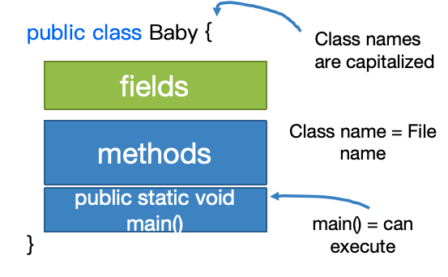
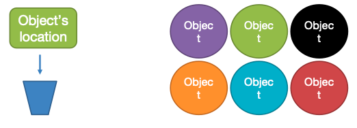
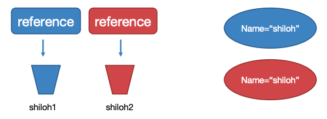

# lecture4-Objects and classes

- Object oriented programming
- Defining Classes
- Using Classes
- References vs Values

# Object oriented programming

- Represent the real world

Objects

- Combine data and operations on that data together (encapsulation)
- Don’t need to understand the implementation, only the interface (abstraction)
- Build a higher level interface from small parts

class

- Templates for creating objects
- Define the data (variables) and code (methods) that an object has
- Create an instance of an object with new

General Guidelines

- Using static is rare: normally want non-static methods and variables
- Class names start with CapitalLetters
- Method names start with lowerCase

# Defining classes



```java
public class Baby {
    String name;
    boolean isMale;
    double weight;
    double decibels;
    int numPoops = 0;

    void poop() {
        numPoops += 1;
        System.out.println(“Dear mother, ”+“I have pooped.  Ready the diaper.”);
        }
}
```

Class Instance: `Baby myBaby = new Baby();`

## Access Control

- public: Accessible by everyone
- private: Accessible only by the same class
- Best practice: mark everything private unless needed by something

## Constructors

- Constructor name == the class name

- No return type - never returns anything

- Usually initialize fields

- All classes need at one constructor

    - If you don’t write one, defaults to

        `classname(){ }`

# Using classes

- ``Baby myBaby = new Baby();``
- `Object.FIELDNAME`
- `Object.METHODNAME([ARGUMENTS])`

```java
// class Definition
	public class Baby {…}
	
// class Instances
	Baby bart = new Baby(“Bart Simpson”, true);
	Baby lisa = new Baby(“Lisa Simpson”, false);
// Accessing fields
	System.out.println(bart.name);	
	System.out.println(bart.weight);
// Calling Methods
	bart.sayHi();	// “Hi, my name is Bart Simpson”
```

# References vs Values

- Primitive types are basic java types
    - int, long, double, boolean, char, short, byte, float
    - The actual values are stored in the variable
- Reference types are arrays and objects
    - String, int[], Baby, …

## How java stores primitives

- Variables are like fixed size cups
- Primitives are small enough that they just fit into the cup


## How java stores objects

- Objects are too big to fit in a variable
- Stored somewhere else
- Variable stores a number that locates the object



##References

- The object’s location is called a reference
- == compares the references
- Baby shiloh1 = new Baby(“shiloh”);	Baby shiloh2 = new Baby(“shiloh”);
- Does shiloh1 == shiloh2 ?——No




