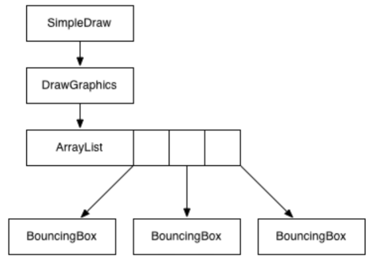

# lecture6-Design, debugging, interfaces

- Good program design
- Debugging
- Interfaces

## Good program design

What is a good program?

- Correct / no errors
- Easy to understand
- Easy to modify/extend
- Good performance (speed)

Consistency

- Writing code in a consistent way makes it easier to write and understand
- Programming “style” guides: define rules about how to do things
- Java has some widely accepted “standard” style guidelines

Naming

- Variables: Nouns, lowercase first letter, capitals separating words

    `x, shape, highScore, fileName`

- Methods: Verbs, lowercase first letter

    `getSize(), draw(), drawWithColor()`

- Classes: Nouns, uppercase first letter

    `Shape, WebPage, EmailAddress`

Good Class Design

- Good classes: easy to understand and use

- Make fields and methods private by default

- Only make methods public if you need to

- If you need access to a field, create a method:

    `public int getBar() { return bar; }`

##Debugging

- The process of finding and correcting an error in a program
- A fundamental skill in programming

Step:

-  Step 1: Don’t Make Mistakes

-  Step 2: Find Mistakes Early

-  Step 3: Reproduce the Error

-  Step 4: Generate Hypothesis

-  Step 5: Collect Information

-  Step 6: Examine Data

### Step 1: Don’t Make Mistakes

- Don’t introduce errors in the first place
- Reuse: find existing code that does what you want
- Design: think before you code
- Best Practices: Recommended procedures/techniques to avoid common problems

#### Design: Pseudocode

> - A high-level, understandable description of what a program is supposed to do
> - Don’t worry about the details, worry about the structure

##### Pseudocode: Interval Testing

> - Example:	Is a number within the interval [x, y)?
> - If number < x return false
> - If number > y return false
> - Return true

#### Design Draw

> - Visual design for objects, or how a program works
> - Don’t worry about specific notation, just do something that makes sense for you
> - Scrap paper is useful



### Step 2: Find Mistakes Early

- Easier to fix errors the earlier you find them
- Test your design
- Tools: detect potential errors
- Test your implementation
- Check your work: assertions

#### Testing: Important Inputs

> - Want to check all “paths” through the program.
> - Think about one example for each “path”
> - Example:	Is a number within the interval [x, y)?

#### Intervals: Important Cases

> - Below the lower bound
> - Equal to the lower bound
> - Within the interval
> - Equal to the upper bound
> - Above the upper bound
> - What if lower bound > upper bound?
> - What if lower bound == upper bound?
> - (hard to get right!)

#### Pseudocode: Interval Testing

> - Is 5 in the interval [3, 5)?
> - If number < x return false
> - If number >= y return false
> - Return true 

#### Assertions

> - Verify that code does what you expect
> - If true: nothing happens
> - If false: program crashes with error
> - Disabled by default (enable with -ea)
> - `assert difference >= 0;`

```java
void printDifferenceFromFastest(int[] marathonTimes) {
    int fastestTime = findMinimum(marathonTimes);

    for (int time : marathonTimes) {
        int difference = time - fastestTime;
        assert difference >= 0;
        System.out.println("Difference: " + difference);
    }
}

```

### Step 3: Reproduce the Error

- Figure out how to repeat the error
- Create a minimal test case
- Go back to a working version, and introduce changes one at a time until the error comes back
- Eliminate extra stuff that isn’t used 

### Step 4: Generate Hypothesis

- What is going wrong?
- What might be causing the error?
- Question your assumptions: “x can’t be possible:” What if it is, due to something else?

### Step 5: Collect Information

- If x is the problem, how can you verify?Need information about what is going on inside the program
- `System.out.println() is very powerful`

### Step 6: Examine Data

- Examine your data
- Is your hypothesis correct?
- Fix the error, or generate a new hypothesis

## Interfaces

Why Use Methods?

- Write and test code once, use it multiple times: avoid duplication
- Use it without understanding how it works: encapsulation / information hiding

Why Use Objects?

- Objects combine a related set of variables and methods
- Provide a simple **interface**

### Java Interfaces

- Manipulate objects, without knowing how they work
- Useful when you have similar but not identical objects
- Useful when you want to use code written by others

Interfaces

- Set of classes that share methods
- Declare an interface with the common methods
- Can use the interface, without knowing an object’s specific type
- Only have methods (mostly true)
- Do not provide code, only the definition (called signatures)
- A class can implement any number of interface

Using Interfaces

- Can only access stuff in the interface.
- Drawable d = new BouncingBox(…);
- d.setMovementVector(1, 1);
- The method setMovementVector(int, int) is undefined for the type Drawable

Casting

- If you know that a variable holds a specific type, you can use a cast:

```java
Drawable d = new BouncingBox(…);
BouncingBox box = (BouncingBox) d;
box.setMovementVector(1, 1);
```


