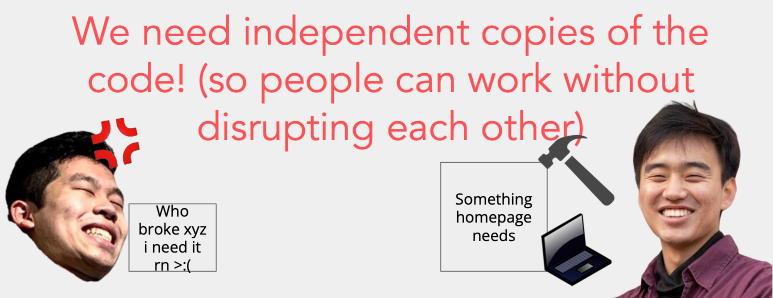
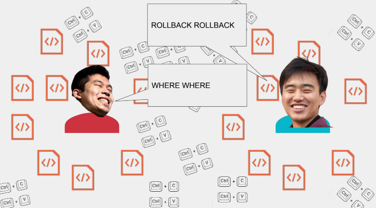
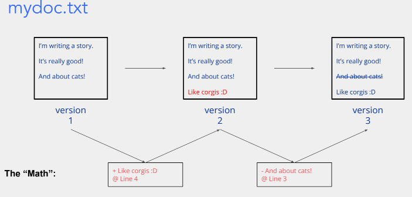
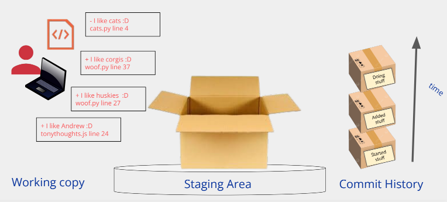
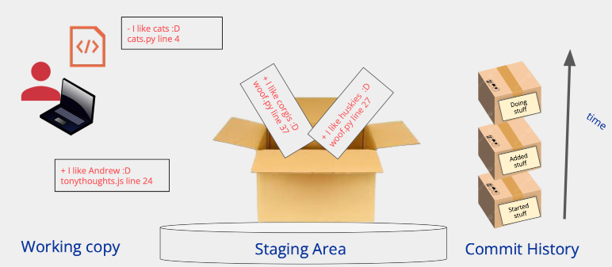
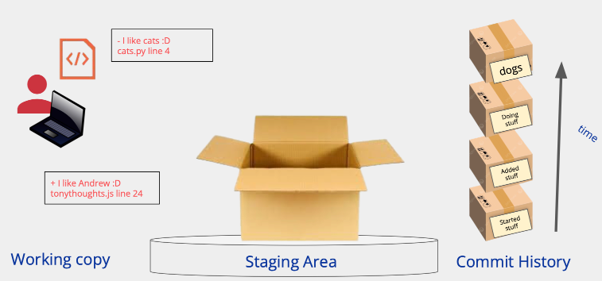
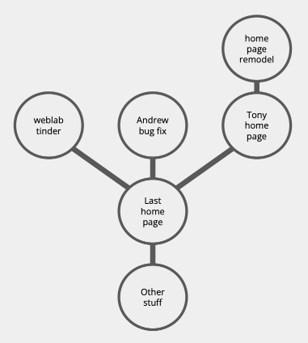

# Git basic

MIT-web-2024-Git-basic

# How do we collaborate on code?

## The issue with Code-Sharing

The Problems

- Need independent local copies of the codebase

- Need to be able to merge different people’s changes together 

- Need to keep track of versions
- Need to know which version is the most up-to-date

## How do we solve these issues? 

What does Git do?

Git tracks changes.

## Demonstration hello-world

**Try the following**:

1. Make a new directory
2. Cd into that directory
3. Turn your directory into a git repo!

**Reference Command**：

- `cd [directory]` change directory
- `ls` list the contents of current directory
- `mkdir [folder_name]` make directory
- `git init` turns current directory into git repo!
- Special Characters:
    - `.`  current directory
    - `..`  parent directory

## Staging & Committing

### In your new repo…try it

1. Make some code changes
2. Stage changes with git add

3. Commit the changes 

4. Check your commit log

5. (Optional) Repeat! (Try deleting stuff too) 

    a. After you make changes (before you stage them), git diff to see your changes!

Commands Ref

- `git add` stage changes for commit
- `git commit -m “[msg]”`
- `git status` <- use this often!
- `git log` show commit history
- `git diff` show the diff (changes) between working copy and staged/committed copy

## How do we work on multiple features at once?

**Branching**

### In your new directory…

1. Create a new branch
2. Add a couple of commits to your branch, check the log
3. Checkout back to main, check the log
4. Add a couple of commits to main, check the log
5. Try and draw and/or explain to your partner what you think the object graph looks like!

Handy commands

- `git branch` see branches
- `git checkout [branch-name]` switch to existing branch
- `git checkout -b [branch-name]` create and checkout new branch

### merging

